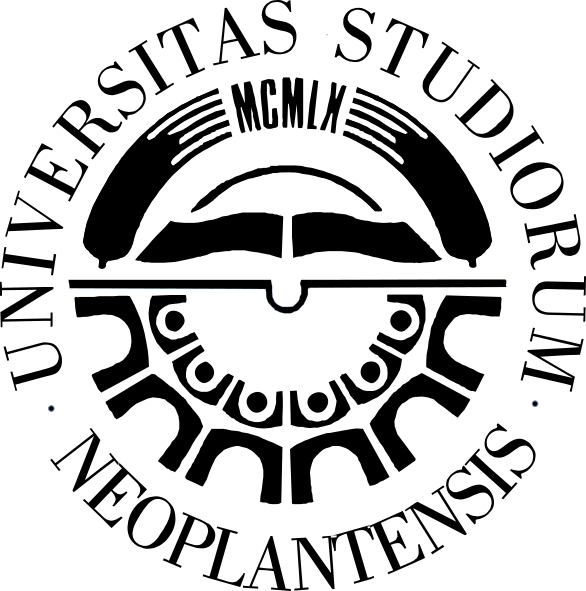
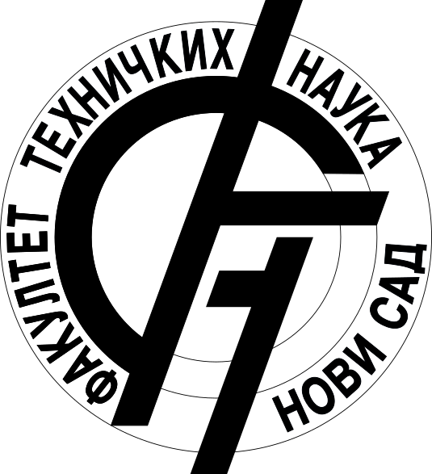
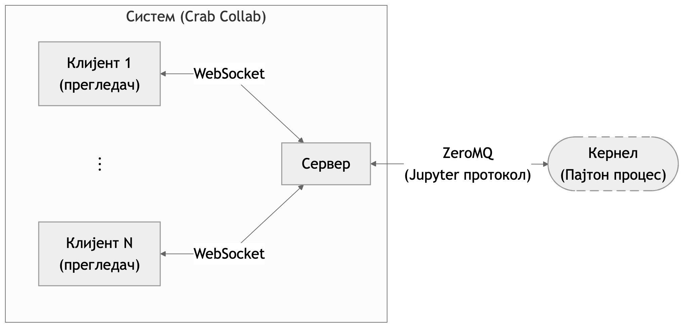
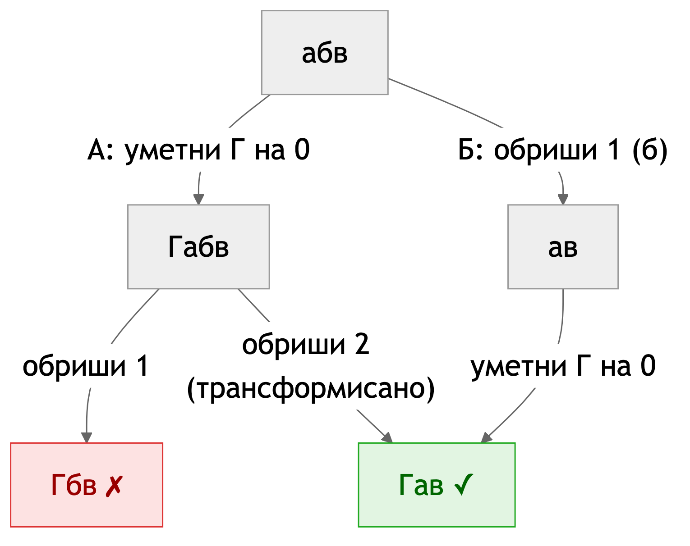
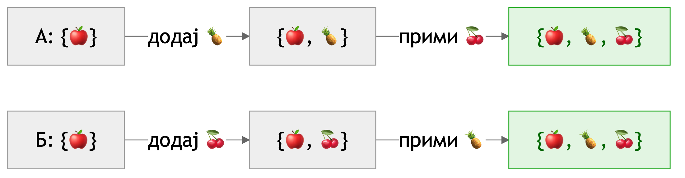
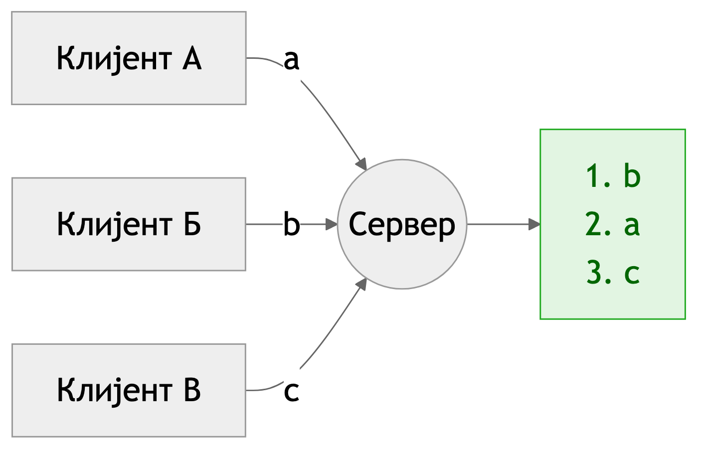

## Колаборативна _Jupyter_ биљежница са подршком за уређивање и извршавање у реалном времену

Никола Јоловић, SV9/2022

Ментор: проф. др Игор Дејановић Нови Сад, 2026.

---

## Проблем

----

### Мотивација

- Рачунарска биљежница (енг. _computational notebook_):
    - текст + код + резултати извршавања
    - _Jupyter_ стандард
- Сарадња у реалном времену:
    - текст: _Google Docs_
    - графика: _Figma_

----

### Циљ и опсег

- _Crab Collab_: колаборативна _Jupyter_ биљежница у реалном времену
- Циљ:
  - рјешавање конфликата при истовременим измјенама
  - интеграција извршавања кода
- Доказ концепта

----

### Демо

<video src="media/demo.mp4" controls></video>

---

## Систем

----

### Архитектура

локална примјена→сервер рјешава конфликт→шаље свима (аутору као потврду)

----

### Технологије

- **Комуникација:**
    - _WebSocket_: клијент–сервер
    - _ZeroMQ_: сервер–кернел
- **Језгро за рјешавање конфликата:** Раст → _WebAssembly_
  - иста имплементација на клијенту и серверу

---

## Рјешавање конфликата

----

### Операциона трансформација

Измјена се **прилагођава** ономе што се десило прије ње

----

### _Conflict-free Replicated Data Type_ (_CRDT_)

Структура **сама** конвергира, редослијед није битан

корисник види
абг

<em>CRDT</em> чува
аА1бА2вБ1гБ2

Цијена: ИД за сваки карактер (реплика + бројач), обрисани остају

----

### Централни сервер

Један редослијед измјена → **оба приступа постају једноставнија**

----

### Домени стања

| Домен | Механизам |
|---|---|
| Поредак ћелија | фракционо индексирање |
| Садржај ћелија | ОТ (централизована) |
| Позиције курсора | изведено из ОТ-а |
| Стање извршавања | серијализација |
| Присуство | без конфликата |

- Сваки домен се синхронизује независно
- Различите гаранције конзистентности по домену

----

### Поредак ћелија

обични индекси
A 0X 1B <s>1</s> 2C <s>2</s> 3

фракциони
A 0.2X 0.3B 0.4C 0.6

опет између
A 0.2X 0.3Y 0.35B 0.4C 0.6

конфликт
А: X 0.3Б: Z 0.3
→ сервер одлучује

<b>Уметање и премјештање мијењају само једну ћелију</b>

Индекс је низ бајтова, не <em>float</em>: произвољна прецизност

----

### Текст ћелија

<b>Клијент</b>

на чекању: b

↓ послије потврде

непотврђена: a

a, основа v3 →

← a', v6 (свима)

<b>Сервер: историја ћелије</b>

v3v4v5v6 = a'

a се трансформише кроз v4, v5

Клијент: највише **једна непотврђена** и **једна на чекању**

Сервер: трансформише у односу на конкурентне измјене

Курсори се помјерају кроз исте операције

----

### Закључавање

<b>Поредак ћелија</b> 🔒

ABC ↕

премјештање

<b>Садржај ћелија</b>

A 🔒B 🔒C 🔒

истовремено куцање

<ul>
<li>Текст и структура се не блокирају</li>
<li class="fragment"><b>Уметање:</b> нову ћелију још нико не види</li>
<li class="fragment"><b>Брисање:</b> измјена прије или послије → исто стање</li>
</ul>

---

## Извршавање кода

⏳ ћ3⏳ ћ2→⚙️ кернел: ▶ ћ1

једна ћелија у тренутку, редом

Слободна→⏳ У реду→▶ Извршава се→Слободна

поново „покрени” док чека или ради → одбијено

<ul>
<li class="fragment">Извршава се код из тренутка захтјева</li>
<li class="fragment"><b>Обрисана ћелија:</b> излаз се одбацује</li>
</ul>

---

## Закључак

- **Резултат:** пет независних, замјењивих механизама
- **Предности:** без _CRDT_ метаподатака, исто језгро на клијенту и серверу
- **Ограничења:** стање у меморији, једна биљежница
- **Будући рад:** постојаност, аутентификација, офлајн рад, _undo_

---

## Хвала на пажњи

Питања?

github.com/Nikola352/crab-collab

